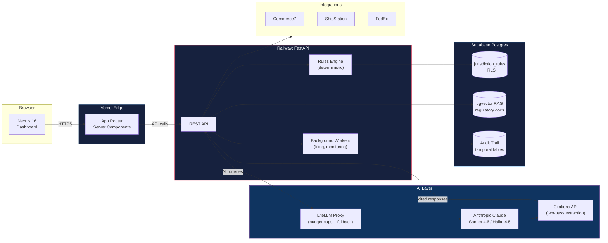

# Ratify

> A personal project: a multi-tenant compliance engine I built and run in production. It does real-time order gating and regulatory intelligence across all 51 US jurisdictions, on a deterministic rules engine.

---

**This repository documents the architecture and design decisions for Ratify. The implementation is private.**

📄 [Portfolio](https://jamesshehan.dev)

---

## Problem

Selling beverage alcohol in the US means complying with a maze of federal and state regulations:

- **50 states + DC**, each with different licenses, tax rates, volume limits, product restrictions, filing frequencies, and dry communities
- **Two distribution channels** (direct-to-consumer and three-tier wholesale), each with its own rule set
- **Constant regulatory change**: 10+ compliance alerts per year from the Wine Institute alone
- **Fragmented tooling**: existing compliance tools are enterprise-priced and split across many products; smaller producers fall back to spreadsheets and manual research

Most small producers lack the budget for enterprise compliance software. The same regulatory maze hits breweries, cideries, and distilleries.

## Architecture

Ratify is a **split-backend application**: a long-running FastAPI service on Railway carries the compliance engine, AI extraction pipeline, and background workers; a Next.js dashboard on Vercel handles the user-facing surface; Supabase Postgres holds tenant data with Row-Level Security and pgvector-backed regulatory RAG.

| Component | Function |
|-----------|----------|
| **FastAPI on Railway** | Long-running compliance jobs, no serverless duration limits, full Python AI ecosystem |
| **Next.js 16 on Vercel** | Server Components, edge rendering, fast dashboard surface |
| **Rules Engine** | Deterministic compliance checks and tax calculations, sub-100ms, no LLM in the critical path |
| **LiteLLM Proxy** | Hard budget caps, per-tenant cost tracking; automatic fallback on non-citation calls (two-pass Citations extraction is Anthropic-specific) |
| **Anthropic Citations API** | Two-pass extraction with verbatim source citations for auditable regulatory analysis |
| **Supabase Postgres + RLS** | Row-Level Security multi-tenancy, pgvector for RAG, temporal tables for audit reconstruction |

## Tech Stack

| Technology | Role | Why This Choice |
|-----------|------|-----------------|
| FastAPI on Railway | Backend API | 800s+ batch jobs, persistent workers, no Vercel duration ceiling, portable Docker |
| Next.js 16 on Vercel | Frontend | App Router, Server Components, edge caching for marketing + dashboard |
| Supabase (Postgres) | Database | RLS multi-tenancy, pgvector for RAG, temporal tables for audit, SOC 2 on Team plan |
| pgvector | Regulatory RAG | Native Postgres extension, HNSW indexing, no separate vector DB |
| Anthropic Claude Sonnet 4.6 / Haiku 4.5 | LLM tier | Sonnet for extraction quality, Haiku for cost-tiered routine work, ephemeral prompt caching |
| LiteLLM Proxy | Model routing | Hard budget caps, semantic caching; fallback covers non-citation calls (the Citations path is Anthropic-specific) |
| Sentry | Observability | PII-scrubbed exception tracking, integrated with FastAPI middleware |
| GitHub Actions | CI/CD | Nine workflows including nightly smoke, security scans, dependabot auto-merge |
| Commerce7 / ShipStation / FedEx | Integrations | DTC platform connectivity, fulfillment, carrier compliance |

## Technical Challenges & Solutions

### 1. Compliance Must Be Deterministic, But Regulatory Text Is Unstructured

**Challenge**: Compliance checks must be 100% reliable, fast (<100ms), and auditable. LLM latency (1-5 seconds) is unacceptable for real-time order gating, and hallucination risk is unacceptable for tax calculations. But the underlying regulatory source material (state statutes, TTB rulings, DOR bulletins) is unstructured text scattered across 50+ government sites.

**Solution**: Strict separation of concerns (D-009). The deterministic rules engine handles every compliance check and tax calculation in-line: order gating, tax math, license expiration. AI sits *next to* the critical path, not inside it. The LLM does what it's good at: natural-language compliance questions, regulatory document extraction, expansion planning, and report synthesis. An AI provider outage degrades the assistive features but never breaks the core product.

### 2. Verifiable Extraction Across 51 Jurisdictions

**Challenge**: A compliance product is only useful if its rules are correct. Naive LLM extraction from regulatory pages produces plausible-looking JSON with no audit trail and no way to retrace conclusions. Worse, different state DORs vary wildly in page structure, citation conventions, and update cadence.

**Solution**: Two-pass Citations + Structured Outputs on Claude Sonnet 4.6. Pass 1 locates citation spans in the source document; pass 2 validates extracted values against the schema and the cited spans. Ephemeral prompt caching (5m TTL, 0.10x read rate) cuts cost ~10x for repeated source documents. Wave 3 progressed through Tier-3A → 3B → 3C → 3D state-by-state, with judge-grade HIGH-confidence wine-DTC extractors and signed evidence artifacts per state. 52 golden eval fixtures and 1,273 tests gate regressions in CI.

### 3. Multi-Tenant Isolation With pgvector

**Challenge**: Multi-tenant isolation requires per-tenant data separation. pgvector HNSW indexes return candidates *before* SQL WHERE filters apply, so a naive query for "tax rules" could surface another tenant's documents in the candidate set before filtering them out.

**Solution**: Row-Level Security at the database layer (D-007). Every tenant-scoped table carries a `tenant_id` column with an RLS policy keyed off `auth.uid()`. The hybrid search RPC applies the tenant filter *inside* the search query, not as a post-filter. Connection-level tenant context is set via `set_config('app.tenant_id', ...)` at request start. Combined with jurisdiction-agnostic data modelling (D-010), isolation holds even as the data model evolves to support new jurisdictions and beverage categories.

## Key Decisions

| Decision | Choice | Rationale |
|---------|--------|-----------|
| D-006 | Split Architecture (FastAPI + Next.js, not monolith) | Vercel function duration limits and read-only filesystem are incompatible with multi-minute filing batch jobs and report generation |
| D-007 | PostgreSQL on Supabase | RLS multi-tenancy, pgvector RAG, temporal audit tables, SOC 2 on Team plan |
| D-008 | LiteLLM as the model gateway | Hard budget caps, cost tracking, semantic caching; fallback scoped to non-citation calls, since two-pass Citations extraction is Anthropic-specific |
| D-009 | AI never in the critical path | Compliance and tax calculations are deterministic rules; AI handles NL, extraction, advice, reports |
| D-010 | Jurisdiction-agnostic data model | `jurisdiction_rules` with `jurisdiction_type` ENUM supports states, counties, cities, territories, future international |
| D-049 | Two-pass Citations extraction | Pass 1 locates citation spans; pass 2 validates against schema, yielding auditable LLM extraction with verbatim source provenance |

See [docs/tech-decisions.md](docs/tech-decisions.md) for detailed excerpts.

## Results

- **Wine DTC compliance extraction across all 51 US jurisdictions** (50 states + DC), graded HIGH-confidence at extraction time
- **54 Postgres migrations, 1,273 automated tests** across the FastAPI backend
- **32 compliance rule keys, 52 golden eval fixtures** gating regressions in CI
- **9 GitHub Actions workflows** including nightly smoke tests, security scans, agentshield, and Copilot rereview automation
- **Deployed**: API on Railway, web on Vercel, Supabase us-east-1
- **Daily and global LLM budget caps** with Sentry PII-scrubbed observability

## Project Status

| Phase | Status | Description |
|-------|--------|-------------|
| Wave 1: Foundation | ✅ | Multi-tenant schema, RLS policies, FastAPI scaffold, Next.js dashboard |
| Wave 2: Tier-A Core | ✅ | Core extractors, rules engine, Citations integration, ingestion pipeline |
| Wave 3: 51 Jurisdictions | ✅ | Tier-3A/3B/3C/3D state extractors, golden fixtures, signed evidence artifacts |

---

**Built by [James Shehan](https://jamesshehan.dev)**

