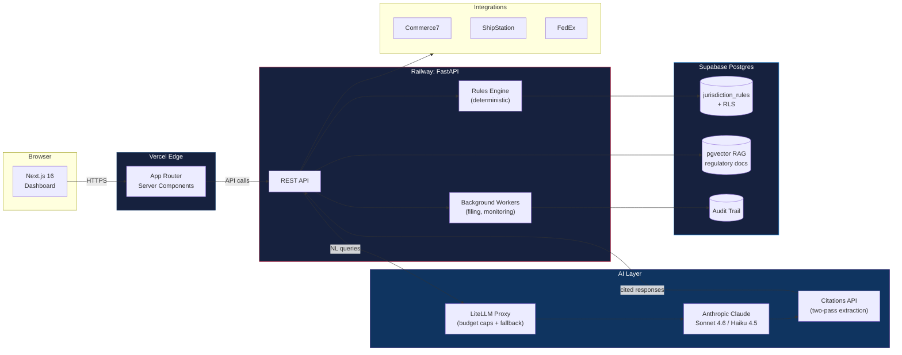

# Ratify: Alcohol Shipping Compliance Engine

> A personal project: a compliance engine I built that tells alcohol producers where they can legally ship across all 51 US jurisdictions, and cites the statute or refuses to answer.

---

**This repository documents the architecture and design decisions for Ratify. The implementation is private.**

[Portfolio case study](https://jamesshehan.dev/projects/ratify) · [Blog post](https://jamesshehan.dev/blog/compliance-saas-architecture-ratify)

---

## Problem

Selling beverage alcohol in the US means complying with federal rules and the rules of 50 states plus DC:

- **50 states + DC**, each with different licenses, tax rates, volume limits, product restrictions, filing frequencies, and dry communities
- **Two distribution channels** (direct-to-consumer shipping, and three-tier wholesale through distributors and retailers), each with its own rule set
- **Constant regulatory change** across 51 jurisdictions
- **Scattered sources**: the rules live in state statutes, federal Alcohol and Tobacco Tax and Trade Bureau (TTB) rulings and state revenue-department bulletins across 50+ government sites, so producers often fall back to spreadsheets and manual research

The same rules reach wineries, breweries, cideries and distilleries.

## Architecture

Ratify is a **split-backend application**: a long-running FastAPI service on Railway carries the compliance engine, AI extraction pipeline, and background workers; a Next.js dashboard on Vercel handles the user-facing surface; Supabase Postgres holds each workspace's data with Row-Level Security and pgvector-backed regulatory search.

```mermaid
flowchart LR
    subgraph Client["Browser"]
        UI["Next.js 16<br/>Dashboard"]
    end

    subgraph VercelLayer["Vercel Edge"]
        Web["App Router<br/>Server Components"]
    end

    subgraph RailwayLayer["Railway: FastAPI"]
        API["REST API"]
        Rules["Rules Engine<br/>(deterministic)"]
        Workers["Background Workers<br/>(filing, monitoring)"]
    end

    subgraph LLM["AI Layer"]
        LiteLLM["LiteLLM Proxy<br/>(budget caps + fallback)"]
        Claude["Anthropic Claude<br/>Sonnet 4.6 / Haiku 4.5"]
        Cite["Citations API<br/>(two-pass extraction)"]
    end

    subgraph DB["Supabase Postgres"]
        Tenants[("jurisdiction_rules<br/>+ RLS")]
        Vec[("pgvector RAG<br/>regulatory docs")]
        Audit[("Audit Trail")]
    end

    subgraph Ext["Integrations"]
        Comm7["Commerce7"]
        SS["ShipStation"]
        FedEx["FedEx"]
    end

    UI -->|HTTPS| Web
    Web -->|API calls| API
    API --> Rules
    API --> Workers
    API -->|NL queries| LiteLLM
    LiteLLM --> Claude
    Claude --> Cite
    Cite -->|cited responses| API
    Rules --> Tenants
    API --> Vec
    Workers --> Audit
    API --> Ext

    style RailwayLayer fill:#16213e,stroke:#e94560,color:#fff
    style VercelLayer fill:#16213e,stroke:#0f3460,color:#fff
    style LLM fill:#0f3460,stroke:#533483,color:#fff
    style DB fill:#16213e,stroke:#2496ED,color:#fff
```

| Component | Function |
|-----------|----------|
| **FastAPI on Railway** | Long-running compliance jobs, no serverless duration limits, full Python AI ecosystem |
| **Next.js 16 on Vercel** | Server Components, edge rendering, fast dashboard surface |
| **Rules Engine** | Deterministic compliance checks and tax calculations, sub-100ms, no LLM in the critical path |
| **LiteLLM Proxy** | Hard budget caps, cost tracking per workspace; automatic fallback on non-citation calls (two-pass Citations extraction is Anthropic-specific) |
| **Anthropic Citations API** | Two-pass extraction with verbatim source citations for auditable regulatory analysis |
| **Supabase Postgres + RLS** | Each workspace's data kept separate, pgvector for regulatory search, audit trail |

## Tech Stack

| Technology | Role | Why This Choice |
|-----------|------|-----------------|
| FastAPI on Railway | Backend API | 800s+ batch jobs, persistent workers, no Vercel duration ceiling, portable Docker |
| Next.js 16 on Vercel | Frontend | App Router, Server Components, edge caching for the dashboard |
| Supabase (Postgres) | Database | Row-Level Security keeps each workspace's data separate, pgvector for regulatory search, audit trail |
| pgvector | Regulatory RAG | Native Postgres extension, HNSW indexing, no separate vector DB |
| Anthropic Claude Sonnet 4.6 / Haiku 4.5 | LLM tier | Sonnet for extraction quality, Haiku for cost-tiered routine work, ephemeral prompt caching |
| LiteLLM Proxy | Model routing | Hard budget caps, semantic caching; fallback covers non-citation calls (the Citations path is Anthropic-specific) |
| Sentry | Observability | PII-scrubbed exception tracking, integrated with FastAPI middleware |
| GitHub Actions | CI/CD | 30+ workflows including CI, nightly smoke tests and security scans |
| Commerce7 / ShipStation / FedEx | Integrations | DTC platform connectivity, fulfillment, carrier compliance |

## Technical Challenges & Solutions

### 1. Compliance Must Be Deterministic, But Regulatory Text Is Unstructured

**Challenge**: Compliance checks must be reliable, fast (<100ms), and auditable. LLM latency (1-5 seconds) is too slow for real-time order gating, and hallucination risk rules it out for tax calculations. But the underlying regulatory source material (state statutes, federal Alcohol and Tobacco Tax and Trade Bureau (TTB) rulings, state Department of Revenue (DOR) bulletins) is unstructured text scattered across 50+ government sites.

**Solution**: Strict separation of concerns (D-009). The deterministic rules engine handles every compliance check and tax calculation in-line: order gating, tax math, license expiration. AI sits *next to* the critical path, not inside it. The model handles the unstructured work: natural-language compliance questions, regulatory document extraction, expansion planning, and report synthesis. An AI provider outage degrades the assistive features but never breaks the core product.

### 2. Verifiable Extraction Across 51 Jurisdictions

**Challenge**: A compliance product is only useful if its rules are correct. Naive LLM extraction from regulatory pages produces plausible-looking JSON with no audit trail and no way to retrace conclusions. Worse, different state revenue departments vary widely in page structure, citation conventions, and update cadence.

**Solution**: Two-pass Citations + Structured Outputs on Claude Sonnet 4.6. Pass 1 locates citation spans in the source document; pass 2 validates extracted values against the schema and the cited spans. Ephemeral prompt caching (5m TTL, 0.10x read rate) bills repeated reads of a cached source document at a tenth of the normal input rate. Every answer carries its primary legal citation and a confidence tier, or the engine refuses to answer. 52 recorded test cases replay the citation extraction on every build.

### 3. Keeping Each Workspace's Data Separate With pgvector

**Challenge**: Each workspace's data must stay separate. pgvector HNSW indexes return candidates before SQL filters apply, so a workspace-filtered search can return fewer matches than it asked for.

**Solution**: Row-Level Security at the database layer (D-007). Every workspace-scoped table carries a `tenant_id` column with an RLS policy keyed off `auth.uid()`. The hybrid search RPC applies the workspace filter *inside* the search query, not as a post-filter. Connection-level workspace context is set via `set_config('app.tenant_id', ...)` at request start. Combined with jurisdiction-agnostic data modelling (D-010), isolation holds even as the data model evolves to support new jurisdictions and beverage categories.

## Key Decisions

Each decision is numbered in the project's decision log (D-###); excerpts are in [docs/tech-decisions.md](docs/tech-decisions.md).

| Record | Decision | Rationale |
|---------|--------|-----------|
| D-006 | Split Architecture (FastAPI + Next.js, not monolith) | Vercel function duration limits and read-only filesystem are incompatible with multi-minute filing batch jobs and report generation |
| D-007 | PostgreSQL on Supabase | Row-Level Security keeps each workspace's data separate, pgvector for regulatory search, audit trail |
| D-008 | LiteLLM as the model gateway | Hard budget caps, cost tracking, semantic caching; fallback scoped to non-citation calls, since two-pass Citations extraction is Anthropic-specific |
| D-009 | AI never in the critical path | Compliance and tax calculations are deterministic rules; AI handles plain-English questions, extraction, advice, reports |
| D-010 | Jurisdiction-agnostic data model | `jurisdiction_rules` with `jurisdiction_type` ENUM supports states, counties, cities, territories, future international |
| D-049 | Two-pass Citations extraction | Pass 1 locates citation spans; pass 2 validates against schema, yielding auditable LLM extraction with verbatim source provenance |

## Results

- **753 provisions of state law across all 51 US jurisdictions**, covering wine, beer and spirits shipping
- **37 of 37** sampled high-confidence answers verified against independently located primary sources, zero fabricated citations
- **788 test files, 130 database migrations, 30+ CI workflows**
- **52 recorded test cases** replaying the citation extraction on every build
- **Deployed**: API on Railway, web on Vercel, Supabase us-east-1
- **Daily per-workspace and global LLM budget caps** with Sentry PII-scrubbed observability

## Project Status

| Phase | Status | Description |
|-------|--------|-------------|
| Foundation | Done | The database (with each workspace's data walled off), the compliance service and the dashboard |
| Core rules | Done | Rules engine, citation extraction, document intake |
| All 51 jurisdictions | Done | Wine, beer and spirits shipping rules for every state and DC (753 provisions); the wine rules each carry recorded test cases and signed evidence |

---

**Built by [James Shehan](https://jamesshehan.dev)**

